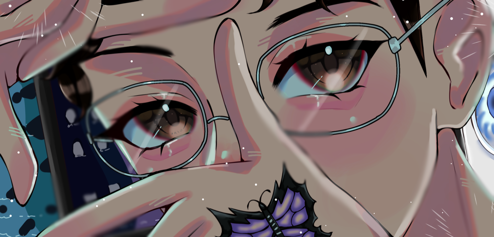

<!-- Header -->

<!-- Discord Presence -->

    

<!-- Introduction -->
### 👋 Greetings, I'm Sebastian

## About Me
&nbsp;
Greetings! I am Sebastian, an 18-year-old individual who finds passion in both Street Workout and Programming. Allow me to share a glimpse into my world:

- 🎮 Avid Gamer
- 📺 Admirer of Anime & Manga
- 💻 Aspiring Programmer
- 📚 Proficient in Project Management
- ⌚ Never available from: 09:00 - 21:00 CEST (working & studying)
- 
Proud Owner of `Ryufy`

## 💼 Experience
- Currently serving as a Software Quality Assurance Tester at [Vera](https://www.somvera.cat)
- Pursuing studies in Cross-platform App Development at [UVic - University of Vic](https://www.uvic.cat/en)
- Hold a prior degree in Micro-computing Systems and Networking from [Escorial Vic](https://www.escorialvic.org)

## 📊 GitHub Stats

  
  

## 📫 Let's Connect
- For prompt communication, reach out to me on Discord: [ItzSebiii](https://discord.com/users/437682275707125760)
- Feel free to contact me via email: [silviusebastian.balint@gmail.com](mailto:silviusebastian.balint@gmail.com)

<!-- Social Badges -->

  
  
  
  
  

